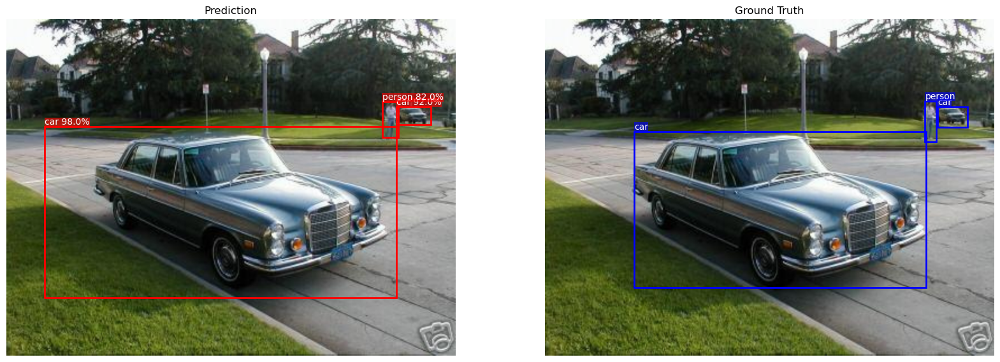
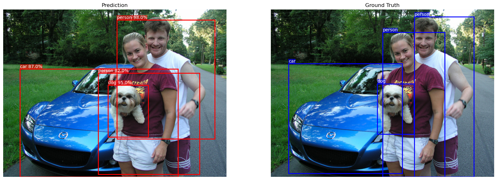

# Faster R-CNN Implementation in PyTorch using Lightning

This repository contains an implementation of the Faster R-CNN object detection model, including a custom implementation of RoI Align, using PyTorch and PyTorch Lightning.

The primary goal of this project is educational: to deepen understanding of the Faster R-CNN architecture and gain practical experience implementing more complex models with PyTorch Lightning.

The implementation uses a pre-trained VGG16 model from `torchvision` as the feature extractor and is trained on the Pascal VOC dataset.

---

## Sample Output

Below is sample output from the trained model on an image from the validation dataset.

```

```

```

```

---

## Key Tools and Design Choices

As this project is primarily for educational purposes, I wanted to briefly reflect on the tools used and the reasoning behind their selection:

### 1. PyTorch Lightning `LightningModule`

Using `LightningModule` helps structure the training, validation, and testing logic.

* **Reduces Boilerplate:** Minimizes repetitive code for the training loop, optimizer steps, etc.
* **Enforces Structure:** Provides a clear and organized framework for the model definition and training steps.
* **Extensibility:** Easily extendable using callbacks. For example, a gradient norm tracking callback was used to monitor gradients during training.
* **Logging Integration:** Simple integration with various loggers like TensorBoard via `self.log` and `self.log_dict`.
  * *Tip:* Design PyTorch `nn.Module` components to return dictionaries containing log data, which can then be easily logged using `self.log_dict` within the `LightningModule`.
* **Checkpointing:** Built-in support for saving model checkpoints, enabling the preservation of various model states and easy resumption of training.

### 2. PyTorch Lightning `LightningDataModule`

Using `LightningDataModule` organizes data loading and preprocessing steps.

* **Structured Data Handling:** Analogous to `LightningModule`, it brings structure to data preparation, splitting, and `DataLoader` creation.
* **Encapsulation:** Keeps all data-related logic (downloading, preprocessing, splitting, loader creation) contained within a single module.

### 3. `jaxtyping` for Shape Annotation

`jaxtyping` is used to annotate the expected shapes of tensors and NumPy arrays, improving code readability and maintainability.

* **Clarity:** Makes tensor dimensions explicit directly in the function signatures or variable annotations.
* **Debugging:** Helps catch shape-related errors early.

Here is an example of how `jaxtyping` is used:

```python
# Define type aliases once at the beginning of the file
Tensor = torch.Tensor
Array = np.ndarray

# Annotate function signatures or variables with expected shapes
def some_function(a: Float[Tensor, "batch N"], b: Float[Tensor, "batch M"]) -> Float[Tensor, "batch N M"]:
    # Example operation
    outer_prod: Float[Tensor, 'batch N M'] = torch.bmm(a[:, :, None], b[:, None,:]) 
    return outer_prod
```

### 4. `einops` for Tensor Manipulation

`einops` provides a powerful and readable way to perform tensor manipulations like rearranging, reshaping, and repeating dimensions.

* **Readability:** Makes complex tensor operations more explicit and easier to understand compared to chains of `view`, `reshape`, `transpose`, and `permute`. The notation clearly describes the input and output dimensions.
* **Flexibility:** Simplifies operations like flattening specific dimensions, unflattening, transposing, space-to-depth, etc.
* **Less Error-Prone:** Reduces the mental overhead of tracking dimension indices, potentially leading to fewer bugs.

Example of using `einops` `rearrange` function:

```python
# Assume num_cls and num_boxes are defined
num_cls = 10
num_boxes = 5

# Example input tensor
tensor: Float[Tensor, 'batch num_cls num_boxes'] = torch.randn(4, num_cls, num_boxes)

# Flatten the last two dimensions (class and box) into one
flattened: Float[Tensor, 'batch (num_cls num_boxes)'] = rearrange(tensor, 'batch cls boxes -> batch (cls boxes)')

# Unflatten the combined dimension back into class and box dimensions
# We need to provide the size of at least one of the dimensions being created.
# Specifying both (e.g., c=num_cls, bx=num_boxes) works too and can act as a double-check.
unflattened: Float[Tensor, 'batch num_cls num_boxes'] = rearrange(flattened, 'batch (cls boxes) -> batch cls boxes', cls=num_cls, boxes=num_boxes)
# Here only one of cls=num_cls and  boxes=num_boxes is necesseay but specifeing both helps to doouble check
```

### 5. Pydantic `BaseModel` for Hyperparameters

Pydantic `BaseModel` is used to define, manage, and validate hyperparameters.

* **Structured Configuration:** Collects all hyperparameters in a single class.
* **Compatibility:** Easily converts to a dictionary using `.model_dump()`, making it compatible with Lightning's `save_hyperparameters`.
* **Validation:** Enables automatic type checking and validation of hyperparameter values (e.g., ranges, constraints) using Pydantic's validators and `Field`.
* **Dynamic Instantiation:** Allows defining configuration elements (like optimizer names or transform names) as strings, which can then be dynamically converted into actual callable classes or functions using helper methods (as shown in the example).

Example of using `BaseModel` for hyperparameter definition and validation:

```python
# Example of a Hparams class
class Hparams(BaseModel):
    train_size: float = Field(0.95, ge=0, le=1)
    val_size: float = Field(0.05, ge=0, le=1)
    test_size: float = Field(0.0, ge=0, le=1)

    optimizer_config: Dict[str, Any] = {"name": "Adam", "params": {"lr": 1e-3},}

    data_transform_config: List[Dict[str, Any]] = [
        {"name": "Resize", "params": {"size": img_shape}},
        {"name": "ToTensor", "params": {}},
        {"name": "Grayscale", "params": {}},
    ]

    @staticmethod
    def get_optimizer(
        model_params, optimizer_config: Dict[str, Any]) -> torch.optim.Optimizer:
        optimizer_name = optimizer_config["name"]
        optimizer_params = optimizer_config["params"]
        optimizer_cls = getattr(torch.optim, optimizer_name)
        return optimizer_cls(model_params, **optimizer_params)


    @staticmethod
    def get_data_transform_pipeline(config: List[Dict[str, Any]]) -> transforms.Compose:
        transform_list = []
        for step in config:
            transform_fn = getattr(transforms, step["name"])
            transform_list.append(transform_fn(**step["params"]))
        return transforms.Compose(transform_list)

    # Validator to ensure dataset splits sum to 1
    @model_validator(mode="after")
    def validate_split_sum(cls, values):
        train = values.train_size
        val = values.val_size
        test = values.test_size
        if not torch.isclose(torch.tensor(train + val + test), torch.tensor(1.0)):
             raise ValueError(
                 f"The sum of train_size ({train}), val_size ({val}), and test_size ({test}) must be 1"
             )
        return values

# Example of accessing the hparams
hparams_instance = Hparams()

optimizer = Hparams.get_optimizer(model.parameters(), hparams_instance.optimizer_config)
transform_pipeline = Hparams.get_data_transform_pipeline(hparams_instance.data_transform_config)
```

---
